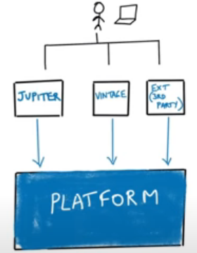
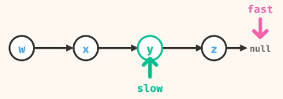
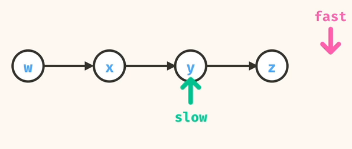
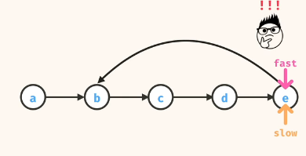

##Junit 5 Basics
- API : Jupiter [New] Vintage [Old]  or Extension [3rd Party]
- IDE uses the platform directly to run the test 
- 
- @Test - Informs Junit Engine to run the test. Can be used as a runner as no news is good news.
- @AssertEquals(expected, actual, "Any custom message")
- @AssertArrayEquals(expectedArray, actualArray)
- @AssertIterableEquals(expectedArray, actualArray)
## LinkedList Palindrome
- One way to solve it is to traverse linked list  and store it in array
- Now we can reverse the array and compare
## LinkedList Middle Value
- Two pointer strategy one fast and the other slow
- Fast will take 2 step at a time
- Slow will take 1 step at a time
- 
- 
## LinkedList Cycle
- One way to solve is to have a set visited, and everytime we iterate through  linked list we check if element contain in SET, if yes return true else add the element in Set. After loop ends return false.
- Other strategy is to solve using, Two pointer strategy one fast and the other slow, if there is cycle we know they will cross each other
!