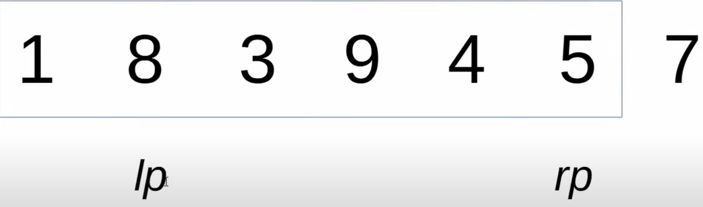
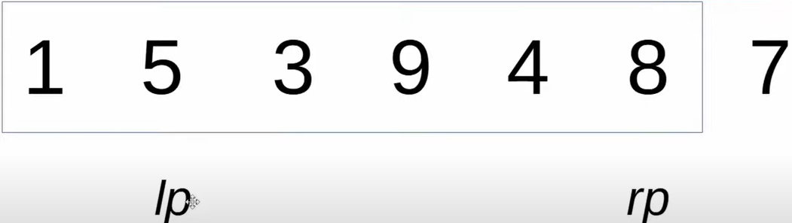
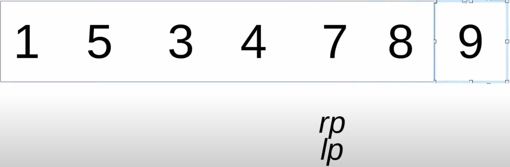

* Select Pivot element
* Partitioning - What is Partitioning ?
  * All the numbers lower than the pivot to the left of the pivot and all the number higher than the pivot to the right of pivot
  * How do we do it? 
    * Say we have an Array 1 8 3 9 4 5 7 ~~[say we choose pivot as last element which is 7]~~
    * Let's use good old 2 pointer strategy
    * leftPointer is at 1 and rightPointer at 5
    * Start with **lp** and find a number larger then pivot [i.e 7]
    * Once we find it stop and move to **rp** and find a number smaller then pivot
    * Now swap them
    * Continue...
    * Once **lp=rp** i.e they point to same element
    * Swap our pivot with overlapping element
    * Partitioning complete which means all elements greater than pivot is to the right and lower to the left
* Recursion 
  * Just call the method recursively changing the low and high index
* Choosing Pivot 
  * Best performance when choose pivot randomly
  * This will give a pivot between low and high index, once we choose index make it the last element, rest of the code will be same
  * 
    `int pivotIndex = new Random().nextInt(highIndex-lowIndex) + lowIndex;
    int pivot = array[pivotIndex];
    swap(array, pivotIndex, highIndex);`